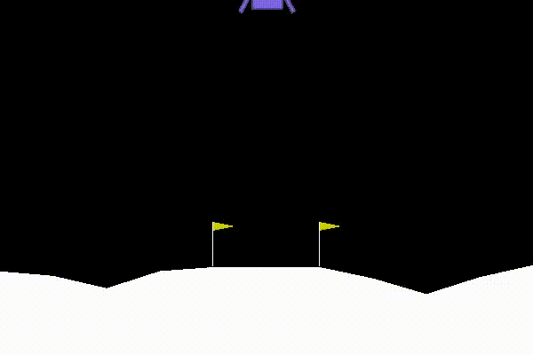

Lunar Lander
============

A reinforcement learning agent for [OpenAI Gym](https://gym.openai.com/envs/LunarLander-v2).

## How to Run

1. Install Python v2.7+
2. (Optional) Invoke a virtual environment via `virtualenv`
3. Install dependencies by running `pip install -r requirements.txt`
4. Run `python run.py` to reproduce all experiments, or...
5. Run `python plot.py` to plot saved data

> NOTE: If Box2D is causing errors, you may need to build from source. Run `git
> submodule update --recursive --remote` and `./build_pybox2d`.

## References

- Bill Learning's YouTube video, https://www.youtube.com/watch?v=Lv_VDz1RhWY
- Hasselt et al, Deep Reinforcement Learning with Double Q-Learning (2015), https://arxiv.org/pdf/1509.06461.pdf
- Matiisen, Demystifying Deep Reinforcement Learning (2015), https://www.intelnervana.com/demystifying-deep-reinforcement-learning/
- Minh et al, Playing Atari with Deep Reinforcement Learning (2015), https://www.cs.toronto.edu/~vmnih/docs/dqn.pdf
- Morales, Applied Reinforcement Learning iPython Notebooks, http://localhost:8888/notebooks/06-function-approximation.ipynb
- Piazza posts: @516 (esp. Charles Snider), @537
